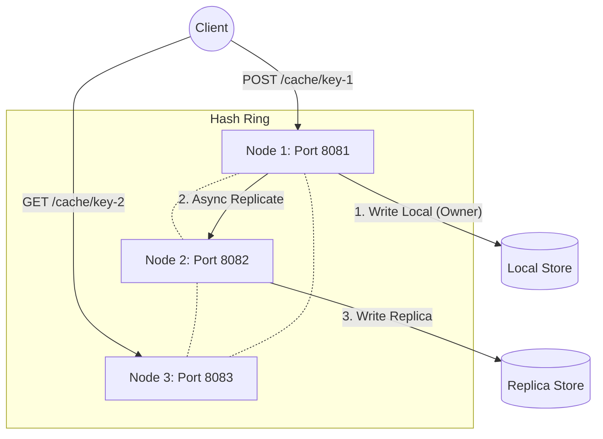
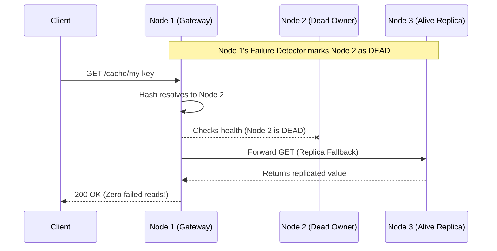

# Kairo — Lightweight Distributed Cache Engine

Kairo is a lightweight, self-healing distributed cache engine built in pure Java 21 without external web frameworks (no Spring, Netty, or Tomcat). 
It implements consistent hashing, asynchronous replication, read fallback, and automatic node failure detection using standard Java concurrency primitives and the JDK built-in HTTP server (`com.sun.net.httpserver.HttpServer`).

The challenge in distributed systems isn't just storing data—it's knowing what to do when nodes fail, network partitions occur, and clocks skew. Kairo solves this by providing a decentralized, AP (Available/Partition-Tolerant) architecture that proactively detects failures and automatically routes around them with zero dropped read requests.

## 🎥 Zero-Downtime Chaos Demo
Watch the system seamlessly handle an abrupt `SIGKILL` of a primary storage node without dropping a single request! 
*The top pane shows proactive failure detection and dynamic routing; the bottom pane shows a client hammering the cluster with zero hard failures.*

[](https://asciinema.org/a/aRqOKTzpVMVCeAMl)
*(Click the link above to view the full terminal recording.)*

### 📊 Chaos Test Audit Results
During a 50-second continuous load test (~30 req/s), one of the three physical nodes was abruptly killed via `SIGKILL`.
* **Total Requests Executed:** `1,473`
* **First-Try Success:** `1,470` (`99.79%`)
* **Retry-Recovered:** `2` (Caught in the exact sub-second crash window; recovered on the first retry via fallback replicas)
* **Hard Failures:** `0` (Zero dropped requests)
* **Detection-to-Reroute Time:** `< 1 second` (Proactive TCP `ECONNREFUSED` interception bypassed the 4.5s heartbeat threshold, updating cluster health maps almost instantly).

---

## 🏗️ System Architecture

### Distributed Consistent Hashing

Kairo uses an MD5-based consistent hash ring with 150 virtual tokens per physical node. This guarantees deterministic routing and even data distribution without requiring a central coordinator.



### Self-Healing & Fallback Routing

Kairo's most distinctive contribution is its proactive failure detection and dynamic read fallback. Nodes ping each other every 1.5 seconds. If a node dies, the cluster routes around it automatically.



### Key Design Decisions
- **Language**: Pure Java 21, zero frameworks. Proves a strong grasp of core concurrency (`ConcurrentSkipListMap`, `ScheduledExecutorService`).
- **Protocol**: HTTP/REST via `com.sun.net.httpserver`. Simplifies cross-node RPCs and debugging.
- **Consistency Model**: AP (Available and Partition-Tolerant) by default, but allows per-request Quorum consistency (`?consistency=quorum`).
- **Replication Factor**: `RF=2`. Each key is stored on its primary owner and one subsequent replica.
- **Eviction**: Dual strategy. Lazy eviction on stale reads + background sweeper daemon, strictly bounded by a max capacity LRU policy.

---

## ⚖️ CAP Trade-offs & Known Limitations

Kairo makes explicit architectural trade-offs:
1. **AP Over CP (Default)**: By default, Kairo prioritizes Availability and Partition Tolerance. Writes return immediately (`201 STORED`) while asynchronous replication happens in the background. There is a small window of eventual consistency where a replica might serve a `404` for a few milliseconds after the primary acknowledges a write.
2. **The Quorum Mode Alternative**: For users who require strict consistency, Kairo supports per-request quorum consistency via `?consistency=quorum`. We measured the physical cost of this trade-off using Apache Benchmark (`ab`):
   - **Default (Async/Eventual) SET:** `~1.3 ms` average per request.
   - **Quorum (Synchronous) SET:** `~4.3 ms` average per request. 
   Quorum mode inherently takes ~3x longer because it must absorb the full HTTP round-trip latency to the replica node before acknowledging the client.
3. **Clock Skew Assumption**: Expiry (`TTL`) logic uses absolute epoch timestamps (milliseconds). While this prevents bugs associated with recomputing `now + ttl` at each network hop, it assumes clock synchronization across nodes (which holds true in a single-host Docker environment). In real multi-DC production systems, you'd need NTP or TrueTime (Spanner).
4. **Eventual View Convergence**: Health checks operate independently without distributed consensus (like Raft). Node health views converge eventually but aren't strictly consistent at every microsecond.

---

## 🐛 What Broke and How I Fixed It

Building a distributed system from scratch reveals edge cases you don't find in tutorials. Here are three major bugs I encountered and resolved:

1. **The Rebalancing Data Gap**: *Bug*: When a dead node rejoined the cluster (`DEAD -> ALIVE`), its virtual tokens were immediately re-inserted into the ring. However, its local memory was completely empty! Clients requesting keys suddenly got `404 Not Found` because the ring routed them to the newly alive (but empty) node instead of the stand-in replicas. *Fix*: I implemented a **Pull-Based Bulk Migration** protocol. Before a node starts serving client traffic, it queries its peers for its assigned key range, absorbing the payloads from the stand-in nodes in bulk.
2. **Infinite Forwarding Loops**: *Bug*: In early iterations, if Node 1 forwarded a request to Node 2, and Node 2 thought Node 1 was actually the owner (due to brief topology disagreements), they would bounce the HTTP request back and forth until the JVM threw a `StackOverflowError` or socket exhaustion. *Fix*: I implemented explicit `X-Kairo-Forwarded: true` and `X-Kairo-Replication: true` HTTP headers. A node instantly rejects forwarding a request that has already been forwarded once, guaranteeing a maximum of 1 network hop.
3. **Quorum Read Split-Brain**: *Bug*: When implementing Quorum Read-Repair, if a non-owner node received the `?consistency=quorum` request, it forwarded the internal query to the owner. The owner, seeing an internal query without a forwarded header, forwarded it back, resulting in a node comparing its own timestamp against itself. *Fix*: Added strict `X-Kairo-Forwarded` tagging to internal Quorum checks to ensure nodes respected internal read-repair queries without triggering the standard consistent-hash forwarding path.

---

## 🚀 Quickstart (Docker Compose)

Launch a fully functional 3-node cluster locally using Docker Compose with zero manual steps:

```bash
# 1. Build and start the 3-node cluster in the background
docker compose up -d --build

# 2. Verify the cluster is healthy and nodes see each other
curl http://localhost:8081/status
```

### Try it out!

```bash
# Write a value with a 60-second TTL
curl -X POST -d "Hello Distributed World" "http://localhost:8081/cache/my-key?ttl=60"

# Read it back from ANY node (Kairo routes it automatically)
curl http://localhost:8082/cache/my-key

# Check which nodes actually hold the data
curl "http://localhost:8081/ring/owner?key=my-key"
```
